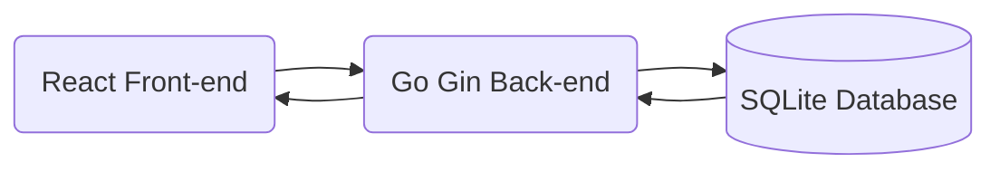

# The French Connections

French OpenSource adaptation of the [NewYorkTime's connections game](https://www.nytimes.com/games/connections)

## General architecture 



## Back-end endpoints

### Create a new game

This endpoint allows anybody to create a new game. It returns a unique created ID pointing to the game.

| HTTP Method | Path  | Content-Type     |
| ----------- | ----- | ---------------- |
| POST        | /game | application/json |

Body example 

```json
{
    "createdBy": "sami",
    "game": [
        {
            "categoryTitle": "FAUX",
            "words": [
                "ARTIFICIAL",
                "FAKE",
                "IMITATION",
                "MOCK"
            ]
        },
        {
            "categoryTitle": "WASHING MACHINE CYCLES/SETTINGS",
            "words": [
                "BULKY", 
                "COTTON",
                "DELICATE",
                "SPIN"
            ]
        }
        {
            "categoryTitle": "WORDS SAID FREQUENTLY IN THE “BILL AND TED” MOVIES",
            "words": [
                "BOGUS",
                "DUDE",
                "EXCELLENT",
                "TOTALLY"
            ]
        },
        {
            "categoryTitle": "___BOX",
            "words": [
                "CHATTER",
                "JUKE",
                "SHADOW",
                "SOAP"
            ]
        }
    ]
}
```

Return result : a UUIDv4 identifying the game

```json
{
    "gameId": "a521c67d-f445-435a-abe2-cc95cddcae13"
}
```

### Retrieve a game

This endpoint is used to retrieve a game

| HTTP Method | Path           |
| ----------- | -------------- |
| GET         | /game/{gameId} |

{gameId} is a UUIDv4 used to identify a game instance

Return result : A game instance with shuffled words

```json
{
    "createdBy": "sami",
    "creationDate": "1741455069",
    "game": ["SPIN", "SHADOW", "EXCELLENT", "JUKE", "TOTALLY", "FAKE", "COTTON", "SOAP", "MOCK", "BOGUS", "CHATTER", "IMITATION", "DELICATE", "DUDE", "ARTIFICIAL", "BULKY"],
}
```

### Guess 

This endpoint is used to make a guess

| HTTP Method | Path            | Content-Type     |
| ----------- | --------------- | ---------------- |
| POST        | /guess/{gameId} | application/json |


Body example

```json
{
    "guess": ["SHADOW", "EXCELLENT", "JUKE", "TOTALLY"]
}
```

#### Return results

The guess endpoint returns one of the following results

##### Negative result

In case of a wrong guess, only 

```json
{
    "success": false,
    "isOneAway": false,
    "categoryTitle": null
}
```

##### One away result

In case of a one away result, only the `isOneAway` flag is set.

```json
{
    "success": false,
    "isOneAway": true,
    "categoryTitle": null
}
```

##### Success result 

In case of a successful guess, the category's title is returned.

```json
{
    "success": true,
    "isOneAway": false,
    "categoryTitle": "WASHING MACHINE CYCLES/SETTINGS"
}
```

