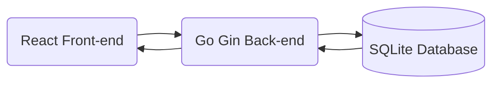

# The French Connections

French OpenSource adaptation of the [NewYorkTime's connections game](https://www.nytimes.com/games/connections)

## General architecture 



## Back-end endpoints

### Create a new game

This endpoint allows anybody to create a new game. It returns a unique created ID pointing to the game.

| HTTP Method | Path  | Content-Type     |
| ----------- | ----- | ---------------- |
| POST        | /game | application/json |

Body example 

```json
[
    {
        "categoryTitle": "FAUX",
        "words": [
            "ARTIFICIAL",
            "FAKE",
            "IMITATION",
            "MOCK"
        ]
    },
    {
        "categoryTitle": "WASHING MACHINE CYCLES/SETTINGS",
        "words": [
            "BULKY", 
            "COTTON",
            "DELICATE",
            "SPIN"
        ]
    }
    {
        "categoryTitle": "WORDS SAID FREQUENTLY IN THE “BILL AND TED” MOVIES",
        "words": [
            "BOGUS",
            "DUDE",
            "EXCELLENT",
            "TOTALLY"
        ]
    },
    {
        "categoryTitle": "___BOX",
        "words": [
            "CHATTER",
            "JUKE",
            "SHADOW",
            "SOAP"
        ]
    }
]
```
### Retrieve a game

